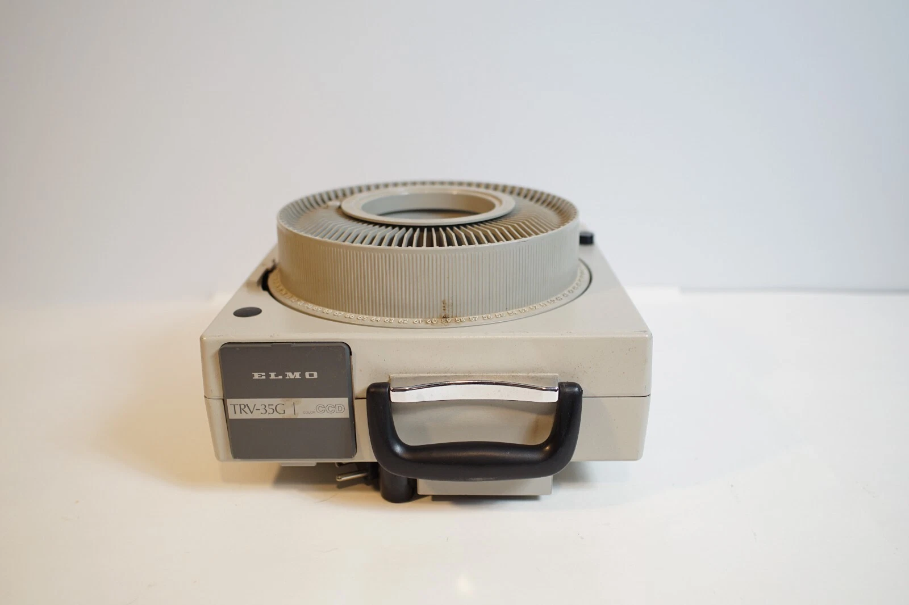
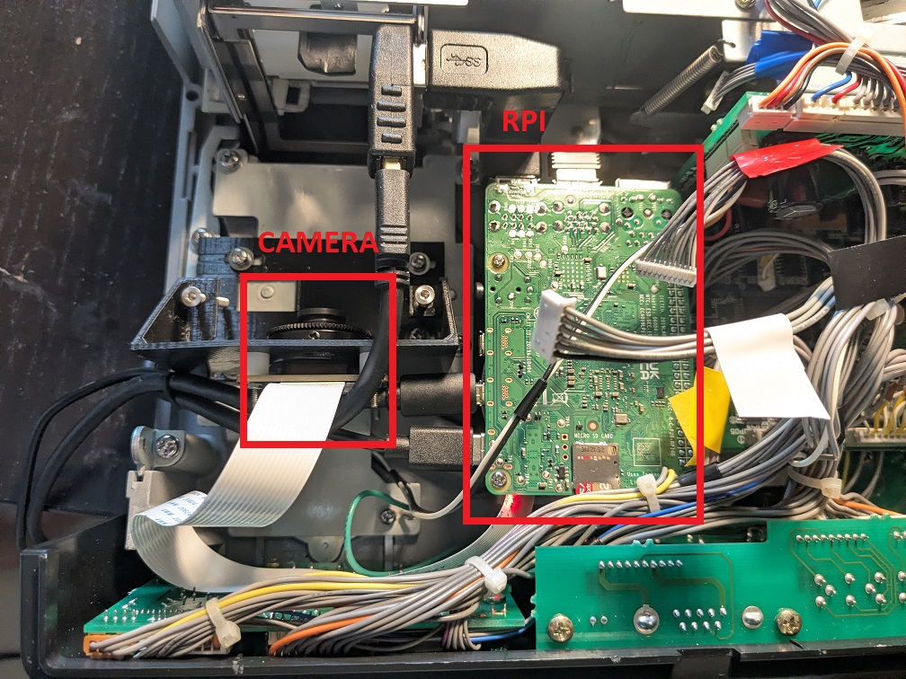
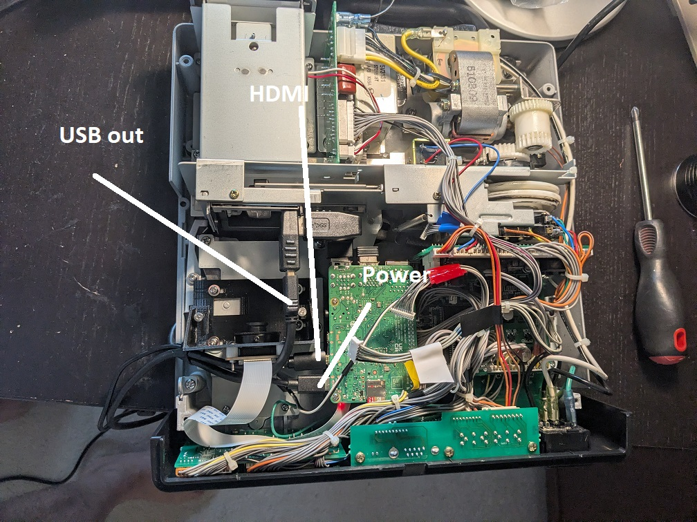

# ELMO TRV-35G Slide Digitizer

This project converts an **ELMO TRV-35G slide projector/viewer** into a slide-digitizing station by mounting a Raspberry Pi camera inside the projector and using a Raspberry Pi to capture images. The original slide-handling mechanism remains the means of presenting slides to the camera.

The photos below show the outside of the projector, the interior camera and Raspberry Pi, and the labeled external connections. They document this particular build; component placement and wiring may differ in other units.


*ELMO TRV-35G exterior.*


*Camera mounted inside the projector (left) and Raspberry Pi board (right). The camera connects to the Pi through a ribbon cable.*


*Overall interior view with labels identifying the HDMI, USB output, and power areas. Verify the exact connector and voltage before connecting or changing wiring.*

## Equipment and software

- ELMO TRV-35G projector/viewer, modified to accommodate the camera and computer.
- Raspberry Pi with an attached **Raspberry Pi HQ (IMX477) camera**, supported lens, and CSI ribbon connection.
- Display connected to the Raspberry Pi to view the live camera image (HDMI is labeled in the photo).
- Keyboard for controlling capture, exposure, and color balance.
- Power supplies and cables appropriate to the projector and Raspberry Pi. The photographs do **not** show how RPI is connected.
- The RPI board is powered from the regular RPI adapter.  
- The HDMI and the USB cables are brought out to be connected to a monitor and a USB hub that can be connected to a keyboard and a mouse. 
- A cutout is made to the projector side cover to accommodate cable routing.  
- Raspberry Pi OS with Python 3, **Picamera2** and **OpenCV (`cv2`)**, plus the Raspberry Pi camera stack. The script also uses standard-library modules and can use `xrandr` or `tkinter` to detect screen dimensions.

The current capture program is **`slide_recorder.py`**. It uses Picamera2 for camera access and OpenCV for the full-screen window. It deliberately does **not** use a Qt camera-preview widget in order to give access to the keyboard while the preview is running.  

## Connections and setup

1. **Power off and unplug the projector and Raspberry Pi** before inspecting or changing any internal components. Keep clear of internal AC wiring, moving parts, and hot components.
2. Confirm that the camera is securely positioned in the projector's slide optical path, as shown in the internal photograph. Adjust focus and physical alignment as required for the slide to appear sharp and properly centered. It should be noted that the adjustments can be made even  with the projector bottom cover installed. Undo the screw securing the side cover and open it up. The camera lens will be within the reach and it can be turned to do the focus adjustment. A chrome plated machine screw, visible from the opening, can be use to do the vertical adjustment. For horizontal image adjustment, the bottom cover has to be opened and the 4 camera bracket mounting screws loosened and the whole camera assembly has to be slid one way or the other way until the preview image is centered. 
3. Ensure that the camera ribbon cable is seated correctly at the camera and the Raspberry Pi. Avoid sharp bends and interference with moving parts.
4. Connect the Raspberry Pi to the display through the **HDMI connection** indicated in the overall interior photo.
5. Connect the keyboard to the Pi using an available USB port. 
6. Connect the Raspberry Pi's power adapter and turn it on.  

## Start the capture application

Double click on SlideShow app.

**Images are saved to hqcam directory** 

### Keyboard shortcuts

| Key | Action |
| --- | --- |
| **Space** | Capture and save the current slide as the next numbered JPEG. |
| **M** | Switch to exposure mode and toggle automatic/manual exposure. |
| **C** | Enter manual color adjustment; press again to leave and restore automatic white balance. |
| **R** | In color mode, select the red adjustment. |
| **G** | In color mode, select the relative green adjustment. |
| **U** | Increase the selected manual exposure or color adjustment by about 10%. |
| **D** | Decrease the selected manual exposure or color adjustment by dividing by 1.1. |
| **Q** or **Esc** | Quit the program cleanly. |

**Exposure adjustment:** The application starts in exposure mode with automatic exposure enabled. Press **M** to switch to manual exposure. The camera reads the latest exposure time and analogue gain and locks both. Press **U/D** to change *exposure time* while holding analogue gain fixed. Press **M** again to restore automatic exposure. When exposure mode is selected but auto exposure is enabled, **U/D** do not change exposure; press **M** first.

**Color adjustment and automatic restoration:** Press **C** to enter color mode. The script reads the current automatic white-balance red and blue gains, remembers those starting values, disables automatic white balance (`AwbEnable: False`), and locks the gains for manual adjustment. In color mode:

1. Press **R**, then **U/D**, to raise/lower the **red gain**.
2. Press **G**, then **U/D**, to raise/lower **green relative to red and blue**.
3. Press **C again** to exit color mode: the script switches automatic white balance back on (`AwbEnable: True`) and returns the keyboard to exposure mode. The preview briefly displays `COLOR AUTO RESTORED (automatic white balance on)`.

**What “restore” means:** The program remembers the original automatic gain values for reference and prints them to the terminal when you exit color mode. **It does not freeze the color gains at those original numbers.** Instead, it re-enables the camera's automatic white-balance algorithm, which may select different gains as it adapts to the current slide lighting. Entering color mode again reads and locks the then-current automatic gains. If you want to keep a manually adjusted color balance while capturing several slides, **stay in color mode**; use **Space** to capture without leaving it.

**Important:** The camera's `ColourGains` control has **red and blue** gains, not an independent green gain. To make green stronger *relative* to the other channels, the script reduces **both red and blue gains**; to make it weaker, it increases both. This is relative color-balance adjustment, not an independent hue-wheel control. Red is selected initially when entering color mode. **M** returns to exposure mode and toggles auto/manual exposure, but it **does not** restore automatic white balance; press **C while still in color mode** when you want automatic color restored.
**On-screen feedback:** Exposure and color changes display a status message in the upper-left corner of the **preview for approximately one second**, then clear automatically. Status messages also print to the terminal. This overlay is not present in saved JPEGs. Color and exposure adjustments themselves **do affect** the captured JPEGs.

### Typical slide capture workflow

1. Put a slide in the projector/viewer and illuminate it as required by the original device.
2. Start the capture script and ensure the **OpenCV window has keyboard focus** (click it once if needed).
3. Check slide positioning and focus in the live preview.
4. For manual exposure, press **M**, then **U/D** until the brightness looks right.
5. To adjust color balance, press **C**, then **R** or **G** and **U/D**. Keep color mode active while capturing slides if you want the manual balance to persist. Press **C** again to restore automatic white balance and return to exposure mode.
6. Press **Space** to save the slide. The terminal prints the filename when saved.
7. Advance to the next slide and repeat. Manual exposure carries over until changed. Manual color settings carry over while automatic white balance is disabled; pressing **C** to exit color mode restores automatic white balance.
8. Press **Q** or **Esc** when finished.

### Saved images and display behavior

- Saved image size: **4056 × 3040 pixels**, JPEG, from Picamera2's **main** stream.
- Live preview stream: **960 × 720 pixels**, YUV420, converted for OpenCV display.
- The preview is resized and **center-cropped as needed to fill the display without stretching**. For a wide monitor, some of the live preview is cropped; the saved JPEG retains the complete camera frame.
- Filenames start at **`slide1.jpg`**, then **`slide2.jpg`**, **`slide3.jpg`**, etc.
- At startup, the program scans existing files matching `slide<number>.jpg` in the output directory and continues with **one more than the largest existing number**. This avoids reusing the earlier sequence numbers for an ordinary single running instance.

Example terminal messages:

```text
Preview: 1920 x 1080 | JPEG: 4056 x 3040
Images directory: /path/to/working-directory | next: slide1.jpg
SPACE capture | M auto/manual exposure | C color/exposure mode | R/G select color | U/D adjust | Q/ESC exit
Saved slide1.jpg
EXPOSURE MANUAL  10.0 ms  gain 1.00x
COLOR RED  R gain 1.50  B gain 1.20
```

*The numerical exposure, color gains, screen dimensions, and paths above are illustrative; actual values depend on the camera, monitor, and environment.*

## Camera configuration details

The current script explicitly loads the **`imx477.json`** tuning file and changes the `rpi.alsc` algorithm's `n_iter` setting to `0` if that tuning algorithm is present. This is a build-specific tuning choice: do not assume it is appropriate for a different sensor or camera tuning file.

Automatic screen-size detection uses `xrandr` when available, falls back to `tkinter`, and otherwise assumes 1920 × 1080. If automatic detection is wrong, edit the line near the beginning of the script:

```python
SCREEN_SIZE = (1920, 1080)  # Replace with the monitor's actual resolution
```

The configured capture resolution is the full-size **main** stream. Preview text is drawn *only* onto the resized preview frame; full-resolution JPEGs are captured directly from `main`. Color and exposure controls are applied by the camera pipeline to both streams.

## Troubleshooting

| Issue | Check |
| --- | --- |
| **Nothing happens when pressing keys** | Click once in the OpenCV full-screen window to give it focus; verify that the desktop is receiving keyboard input. |
| **White border or tiny image** | Check the `Preview:` dimensions printed in the terminal; set `SCREEN_SIZE` explicitly to your display's resolution if needed. Do not derive screen dimensions from the preview image rectangle. |
| **Preview cuts off the edges** | This is expected when filling a monitor with a different aspect ratio. It does **not** crop the saved JPEG. |
| **Image too bright or too dark** | Use **M** to lock exposure, then **U/D** to change exposure time. Return to auto with **M** if desired. |
| **U/D don't change exposure** | Return to exposure mode with **C** if currently in color mode, and enable manual exposure with **M**. |
| **U/D change color instead of brightness** | The program is in color mode. Press **C** to return to exposure mode, then **M** if manual exposure is not enabled. |
| **R or G has no effect** | Press **C** to enter color mode first. Then select **R** or **G**, followed by **U/D** to actually change the color balance. |
| **Color does not immediately match its earlier automatic appearance** | Press **C** again *while in color mode* to turn automatic white balance back on; its gains may take a moment to adapt, and may differ from the original snapshot. If you left color mode with **M**, press **C** to enter color mode and **C** again to restore automatic white balance. |
| **Camera does not start** | Confirm the CSI ribbon orientation and seating, IMX477 camera support, required Picamera2/camera software, and availability of `imx477.json`. |
| **Pictures saved to an unexpected folder** | Check the `Images directory:` message. Launch the program from the desired folder. |
| **Capture takes a moment** | Full-resolution JPEG saving is synchronous in the current script; wait for `Saved slideN.jpg` before advancing the slide. |

## Project files

Keep these files in the same directory as this README so the relative photo links display correctly:

```text
README.md
slide_recorder.py
trv35.png
rpi_camera.jpg
output_connections.jpg
```

**Hardware documentation note:** The photos identify component locations and handwritten connector labels, but they do not provide a complete circuit diagram, cable pinout, power specifications, or the procedure for mechanically modifying the projector. Do not use the photographs alone as electrical wiring instructions.
